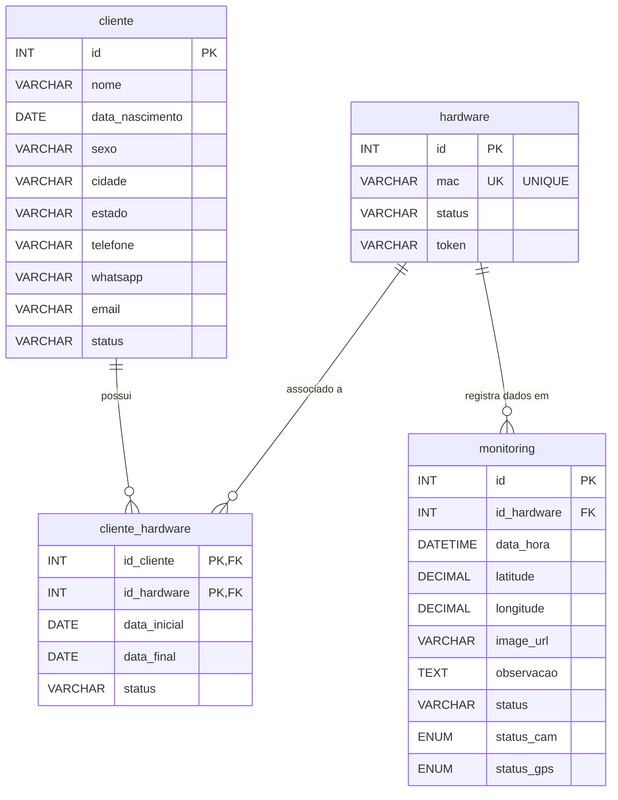

# Diagrama do Banco de Dados - Wearable API

Abaixo está o Diagrama de Entidade-Relacionamento (ER) do banco de dados utilizado pela aplicação. O diagrama mostra as tabelas, suas colunas e os relacionamentos (chaves estrangeiras) entre elas.

Você pode visualizar este diagrama facilmente no próprio VS Code instalando a extensão "Markdown Preview Mermaid Support" ou visualizando diretamente no GitHub.

